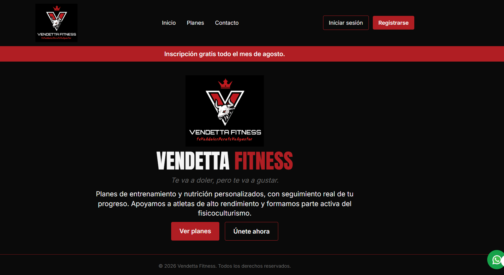
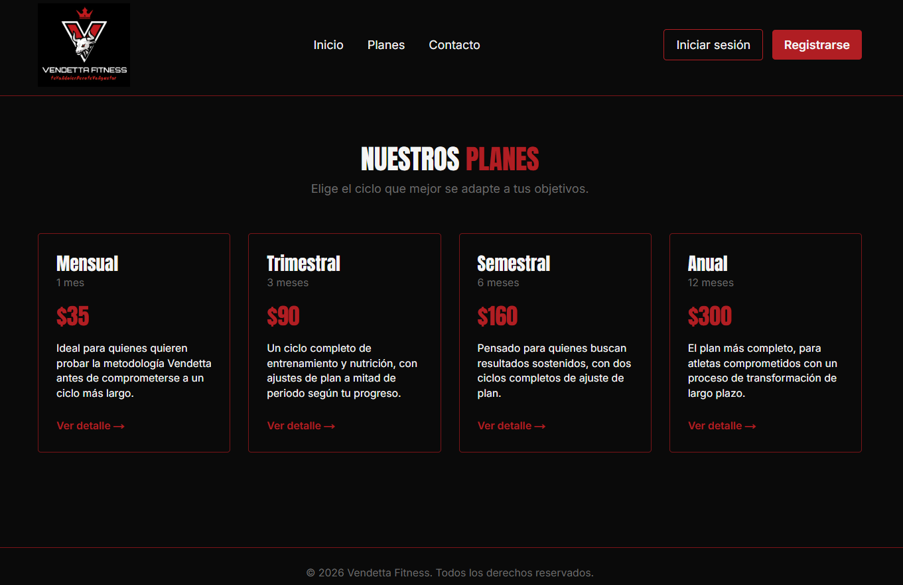
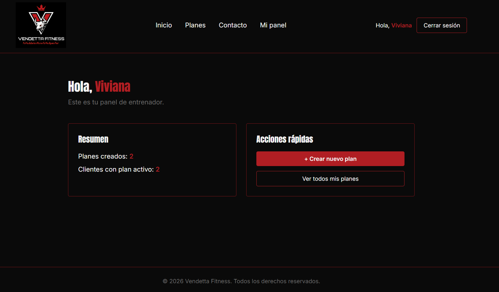

# Vendetta Fitness

Aplicación web full-stack para la gestión de un gimnasio: los clientes pueden ver su plan de entrenamiento y nutrición asignado, dar seguimiento a su peso, y consultar cuándo vence su membresía; los entrenadores pueden crear, editar y eliminar planes para sus clientes.

🔗 **Demo en vivo:** https://pagina-gym-vendetta.vercel.app

## Capturas de pantalla





## Stack tecnológico

- Next.js 14 (App Router)
- TypeScript
- Tailwind CSS
- Supabase (PostgreSQL + Auth + Row Level Security)
- Vercel (deploy)
- API externa: [wger](https://wger.de) (base de datos de ejercicios)

## Roles de usuario

- **Cliente**: se registra, ve su plan de entrenamiento y nutricional asignado, consulta cuándo vence su membresía (mensual/trimestral/semestral/anual), y registra su peso a lo largo del tiempo con un historial filtrable por fecha.
- **Entrenador**: crea, edita y elimina planes para sus clientes, y ve el último peso registrado de cada uno para dar seguimiento a su progreso. El registro como entrenador requiere un código de invitación para evitar que cualquier visitante se auto-asigne ese rol.

## Modelo de datos

Tres tablas relacionadas en Supabase (PostgreSQL), todas con Row Level Security activado:

- **`perfiles`** — extiende `auth.users` de Supabase. Guarda `rol` (cliente/entrenador), `nombre`, `apellido`, `fecha_nacimiento` y `talla`. La edad se calcula dinámicamente desde la fecha de nacimiento, no se almacena.
- **`planes`** — un registro por plan asignado. Relación uno-a-muchos: un cliente puede tener varios planes a lo largo del tiempo, y un entrenador puede crear planes para varios clientes. Incluye `tipo`, `fecha_inicio`, `fecha_fin`, `plan_entrenamiento` y `plan_nutricional`.
- **`pesajes`** — un registro por cada vez que un cliente registra su peso. Relación uno-a-muchos con `perfiles`. El IMC se calcula al vuelo (peso / talla²), no se guarda como columna.

## Instalación local

```bash
git clone https://github.com/moshky/pagina_gym_vendetta.git
cd pagina_gym_vendetta/vendetta_fitness
npm install
cp .env.example .env.local
# completar .env.local con tus propias claves de Supabase
npm run dev
```

## Variables de entorno

Crea un archivo `.env.local` en la raíz del proyecto con:

```
NEXT_PUBLIC_SUPABASE_URL=
NEXT_PUBLIC_SUPABASE_ANON_KEY=
ENTRENADOR_INVITE_CODE=
```

- `NEXT_PUBLIC_SUPABASE_URL` y `NEXT_PUBLIC_SUPABASE_ANON_KEY` se obtienen desde el panel de Supabase, en **Project Settings → API**.
- `ENTRENADOR_INVITE_CODE` es un texto que tú defines — es el código que se debe ingresar al registrarse con rol "Entrenador".

## Credenciales de prueba

| Rol | Nombre | Correo | Contraseña |
|---|---|---|---|
| Entrenador | María Cruz | entrenador.prueba@gmail.com | 123456 |
| Entrenador | Andrés Salazar | entrenador.prueba2@gmail.com | 123456 |
| Cliente | Camila Torres | camila.torres@test.com | 123456 |
| Cliente | Diego Ramírez | diego.ramirez@test.com | 123456 |

*(Para registrar una cuenta de entrenador nueva, se necesita el código de invitación `Vendetta2026.)*

## Funcionalidades implementadas

- [x] Sistema de roles (cliente / entrenador) con permisos diferenciados
- [x] Rutas públicas: `/`, `/planes`, `/planes/[id]`, `/contacto`, `/login`, `/register`
- [x] Rutas privadas protegidas con middleware: `/dashboard`, `/dashboard/planes`, `/dashboard/pesajes`
- [x] Ruta dinámica: `/planes/[id]`
- [x] Base de datos relacional en Supabase con 3 tablas, llaves foráneas y Row Level Security
- [x] Autenticación real: registro, login, logout, protección de rutas
- [x] CRUD completo sobre `planes`: crear, leer, actualizar, eliminar
- [x] Componente interactivo con `useState`: filtro de pesajes por rango de fechas
- [x] Consumo de API externa (wger) con `fetch`/`async-await` y manejo de errores
- [x] Variables de entorno protegidas, nunca expuestas en el repositorio
- [x] Deploy funcional en Vercel

## Video de defensa

[Ver video de defensa] (https://ister-my.sharepoint.com/:v:/g/personal/viviana_arias_ister_edu_ec/IQALiEtayOaPQr8zBeDBsQrQAdat-Ab5Px9Vx0HZminOYFs?nav=eyJyZWZlcnJhbEluZm8iOnsicmVmZXJyYWxBcHAiOiJPbmVEcml2ZUZvckJ1c2luZXNzIiwicmVmZXJyYWxBcHBQbGF0Zm9ybSI6IldlYiIsInJlZmVycmFsTW9kZSI6InZpZXciLCJyZWZlcnJhbFZpZXciOiJNeUZpbGVzTGlua0NvcHkifX0&e=c3cKMa)


## Autor

Viviana Arias — [GitHub](https://github.com/moshky)
